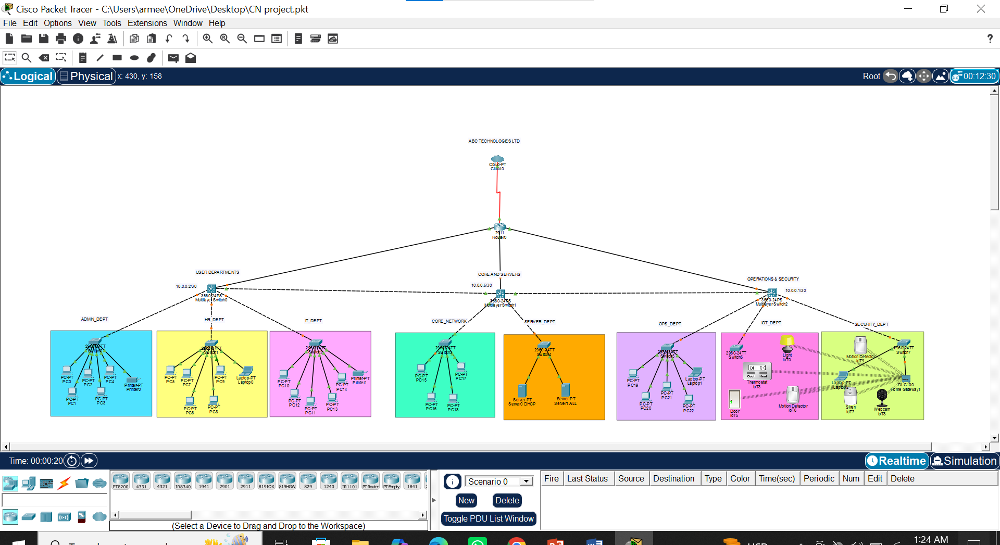

# Enterprise Network Design & Implementation

> A fully configured enterprise network built in Cisco Packet Tracer with VLANs, inter-VLAN routing, DHCP, DNS, and Access Control Lists — developed as a course project for BS Computer Science at Salim Habib University.

---

## About

Modern organizations require secure and efficient computer networks to support communication and resource sharing between departments. Traditional networks often face issues such as excessive traffic, poor security, and inefficient management.

This project presents the design and implementation of a complete **Enterprise Network** using Cisco Packet Tracer, applying real-world networking concepts including the OSI and TCP/IP models, VLAN segmentation, routing, and network security through ACLs.

---

## Network Topology Preview

> 





---

## Features

- **VLAN Segmentation** — departments logically separated using VLANs for traffic isolation
- **Inter-VLAN Routing** — multilayer switching enabling communication between departments
- **DHCP Server** — automatic IP address assignment across all departments
- **DNS Server** — domain name resolution configured for internal network services
- **Access Control Lists (ACLs)** — security rules controlling access between departments
- **Connectivity Testing** — verified using ping, traceroute, and Cisco PT simulation mode
- **Scalable Design** — structured for future wireless integration and advanced routing

---

## Network Design Overview

| Component | Details |
|-----------|---------|
| Topology Type | Hierarchical (Core → Distribution → Access) |
| Departments | Multiple VLANs (HR, IT, Finance, Admin, etc.) |
| Routing | Inter-VLAN routing via multilayer switch |
| IP Addressing | DHCP for automatic assignment |
| Name Resolution | DNS server configured |
| Security | ACLs restricting cross-department access |
| Simulation Tool | Cisco Packet Tracer |

---

## Files in This Repository

```
enterprise-network-design-cisco/
├── network-topology.pkt     # Cisco Packet Tracer project file
├── screenshots/             # Network topology images
│   └── topology-overview.png
├── report/                  # Full project report (PDF)
├── ppt/                     # Presentation slides
└── README.md
```

> **Note:** To open the `.pkt` file, you need **Cisco Packet Tracer** installed (free download from [netacad.com](https://www.netacad.com)). Screenshots are provided for viewing without the software.

---

## How to Open the Project

1. Download and install **Cisco Packet Tracer** from [netacad.com](https://www.netacad.com) (free, requires account)
2. Clone or download this repository
3. Open `network-topology.pkt` in Cisco Packet Tracer
4. Use **Simulation Mode** to observe packet flow between departments
5. Test connectivity using the ping command in device terminals

---

## Technologies & Concepts Used

`Cisco Packet Tracer` `VLANs` `Inter-VLAN Routing` `DHCP` `DNS` `ACL` `OSI Model` `TCP/IP` `Multilayer Switching` `Network Security` `Subnetting`

---

## Course Details

| | |
|---|---|
| Course | Computer Networks |
| Degree | BS Computer Science |
| University | Salim Habib University, Karachi |
| Semester | Spring 2026 |
| Supervisors | Dr Sheeraz Arif · Sir Junaid |

---

## Team

| Name | Student ID |
|------|-----------|
| Armeen Mubeen | S24CSC009 |
| Mahnoor Motiwala | S24CSC027 |

---

## Keywords

`cisco-packet-tracer` `networking` `vlan` `inter-vlan-routing` `dhcp` `dns` `acl` `enterprise-network` `computer-networks` `network-security` `salim-habib-university`
